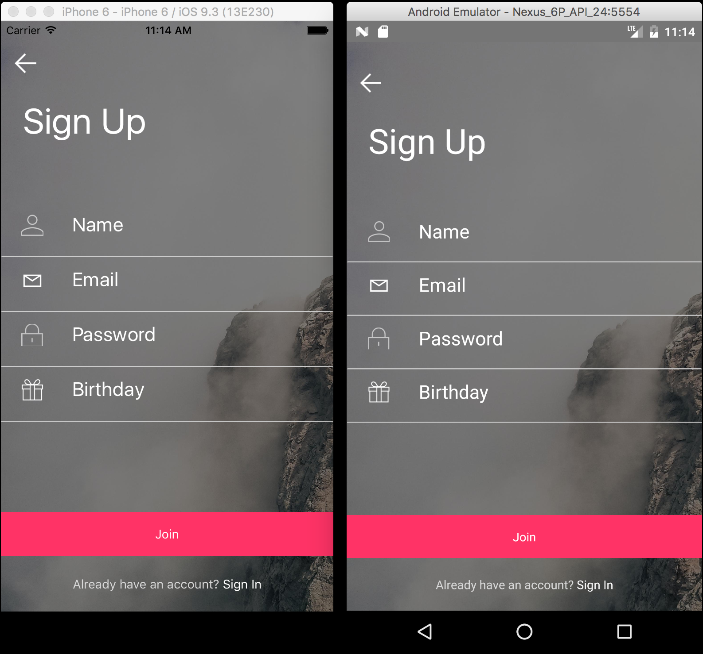

 React Native  starter app that uses all the latest  & greatest  components! - [Demo](#screens)

[](https://github.com/monte9/react-native-starter/blob/master/LICENSE)

---------------

## [Screens](#screens)




---------------

## Installation

* [Install React-Native](https://facebook.github.io/react-native/docs/getting-started.html#content)

* `git clone git@github.com:Monte9/react-native-starter.git`

* `cd react-native-starter`

* `yarn`


## Running the app

* For iOS, from the command line, run via command: ```react-native run-ios``` or open XCode and load project, Run ```Product -> Run (⌘+R)```

* For android, from the command line, run via the command: ```react-native run-android``` assuming you have an emulator or device running and attached

* Hack on!

---------------

# Content

- [Summary](#summary)
- [Technologies](#technologies)
- [Editor Setup](#editor-setup)
- [TODO](#todo)
- [FAQ](#faq)


## Summary

1. The app is a runs on **BOTH** iOS & Android using single codebase mostly written in Javascript.
1. The app has Login & Signup screens with reducers for user input, login & signup actions.
1. The Login & Signup screens display a spinner to indicate activity.
1. The Login & Signup forms also validate user input and display error message about the input fields.
1. The app includes a Tab Bar Controller and is customizable to add more tabs.
1. Each Tab Bar has it's own navigation state and hence can provide independent navigation states.
1. The app uses Navigation Experimental to handle navigation.
1. The app also includes a Side Menu and it's customizable.

## Technologies
*The following are brief descriptions of the technologies used*

### [React-Native](https://facebook.github.io/react-native/) - *LEARN ONCE, WRITE ANYWHERE: BUILD MOBILE APPS WITH REACT*

<a href="https://facebook.github.io/react-native/"></a>

###[Redux](http://redux.js.org/) - *Redux is a predictable state container for JavaScript apps.*

<a href="http://redux.js.org/"></a>

If you'd like to read an excellent tutorial on Redux check this out: [https://egghead.io/courses/getting-started-with-redux](https://egghead.io/courses/getting-started-with-redux)

###[React Native Screens](https://github.com/browniefed/react-native-screens) - *React Native implementation for Do, a free UI kit.*

<a href="https://github.com/browniefed/react-native-screens"></a>

Active contributor on React Native Screens repo. Submitted PR's for Login & Signup screens.

You can see the entire DO library on Invision [here:](https://www.invisionapp.com/do)

###[React Native Vector Icons](https://github.com/oblador/react-native-vector-icons) - *3000 Customizable Icons for React Native with support for NavBar/TabBar/ToolbarAndroid, image source and full stying.*

<a href="https://github.com/oblador/react-native-vector-icons"></a>

###[React Native Side Menu](https://github.com/react-native-community/react-native-side-menu) - *Side menu component for React Native*

<a href="https://github.com/react-native-community/react-native-side-menu"></a>

###[React Native Tab Navigator](https://github.com/exponentjs/react-native-tab-navigator) - *Tab Bar component for React Native*
<a href="https://github.com/exponentjs/react-native-tab-navigator"></a>


## Editor Setup

**Atom**


**Package:** Nuclide

**UI Theme:** One Dark

**Syntax Theme:** Gloom

**Additional Packages:**
```bash
apm install editorconfig es6-javascript javascript-snippets linter linter-eslint language-babel
```


## TODO

- [AsyncStorage](https://github.com/jasonmerino/react-native-simple-store)

- [I18n](https://github.com/AlexanderZaytsev/react-native-i18n)

- [Validate.JS](https://validatejs.org/)

- [Tcomb Form Library](https://github.com/gcanti/tcomb-form-native)

- [Jest](https://facebook.github.io/jest/) & [Snapshot tests](http://facebook.github.io/jest/blog/2016/07/27/jest-14.html)


## FAQ

### Are you accepting PR's?

Yes. This project is actively under development. PR's are much appreciated.

######-Monte Thakkar
